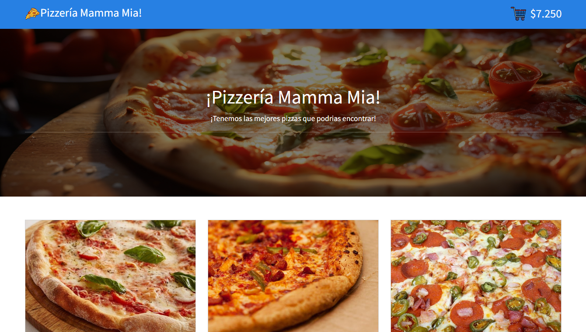

# Módulo 4 REACT II - Desafío 4 - Mamma Mia

## Presentación Página Web

##  

 

## Descripción del Proyecto ⌨️

En este proyecto se ponen en practica las cualidades de react, resaltando el uso de React-Router y ContextAPI para el direccionamiento de el uso eficiente de componentes respectivamente.
Se realizó la creación de un "Custom Hook" cuya función es llamar estados especificos en diferentes vistas, permitiendo así flexibilidad al momento de "entregar" la información al componente deseado.
Se creó tambien un helpero con el fin de realizar la transformación númerica a pesos chilenos.
Se utilizaron tecnologías como bootstrap y toastify añadiento una mejor interactividad para el usuario al momento de realizar una acción.
 
Link al proyecto: https://mammamiadaht.netlify.app/Home

## Tecnologías Usadas 🛠️

- **HTML**
- **CSS**
- **JS**
- **REACT JS**
- **React-Bootstrap**
- **Toastify**

 

---

 

## Autor 👨‍💻

**Daniel Hernández Toledo - Tecnico Electrónico / Soporte TI / Desarrollador Web**